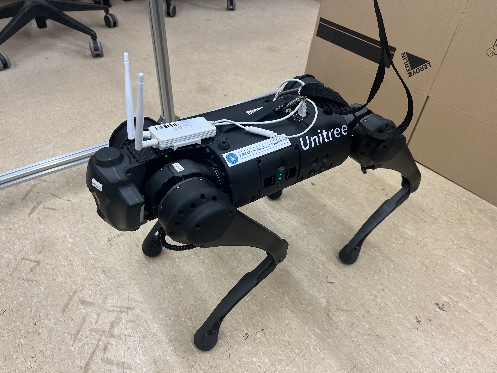

# quadruped_perception
Integration of F/T sensors, IMU and GNSS for Unitree Go1 Edu at PUT

<figure>
   

       
      Unitree Go1 Edu with external router mouted on top at Poznan University of Technology, Source: <a href="">Own work</a>
   

</figure>

## ROS 1 - Noetic Ninjemys

Go to [ROS1 page](./ROS1.md).

References:
- EtherCAT protocol:
   - [Introduction to EtherCAT](https://www.youtube.com/watch?v=xNE1Y7_mH8E)
   - [Application sample - setting up an EtherCAT Master PC as a network bridge, Beckhoff](https://infosys.beckhoff.com/english.php?content=../content/1033/el6601_el6614/2349541771.html&id=)
   - [EtherCAT Group](https://ethercat.org/default.htm)
   - [EtherCAT technology principle](https://www.ethercat.org/en/technology.html)
   - [EtherCAT Slave Implementation Guide](https://www.ethercat.org/download/documents/ETG2200_V3i1i0_G_R_SlaveImplementationGuide.pdf)
- Components:
   - GX-JC06 Junction Slave EtherCAT:
      - [GX-JC03/06 EtherCAT Junction Slave](https://ethercat.org/en/products/031623DF42FD4AAA99F2540BF002E5C6.htm)
      - [GX-JC03/06 EtherCAT Junction Slave OMRON catalog](https://www.ia.omron.com/products/family/3079/download/catalog.html)
   - Unitree Go1 Edu:
      - [datasheet](https://shop.unitree.com/products/unitreeyushutechnologydog-artificial-intelligence-companion-bionic-companion-intelligent-robot-go1-quadruped-robot-dog)
   - Rokubi Mini F/T+IMU Sensors:
      - [Official Rokubi website](https://www.botasys.com/force-torque-sensors/rokubi)
      - [Gitlab Issue, that broke compatibility with older sensors](https://gitlab.com/botasys/bota_driver/-/issues/21)
      - [Issue related to that one above](https://gitlab.com/botasys/bota_driver/-/commit/e29feb2697ed09ef1b40007d608177940c0fc603)

- ROS Noetic:
   - [Overview](http://wiki.ros.org/noetic)
- Docker:
   - [Overview](https://docs.docker.com/get-started/)

<figure>
   

       
      Rubber duck for debugging. Source: <a href="https://commons.wikimedia.org/wiki/File:Rubber_duck_assisting_with_debugging.jpg">Wikipedia</a> 
   

</figure>
