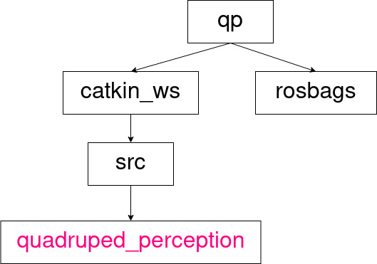

# ROS1 (Noetic Ninjemys)

## Workspace setup

<figure>
   <p align="center">
      
      <figcaption>Directory tree structure, Source: <a href="">Own work</a> </figcaption>
   </p>
</figure>

Create tree of folders for your project:
```sh
mkdir qp
```
Clone the repository inside the main directory:
```sh
git clone -b noetic https://github.com/filesmuggler/quadruped_perception.git
```
### Setup docker container

### Run Vscode with SSH extension

## Rokubi Mini F/T+IMU sensors

### Compatibility issue
Removing PDOs definitions for all types except A type broke the compatibility with older sensors like  BFT-ROK-11-40-xx type used in this project.

<figure>
   <p align="center">
      
      <figcaption>Foot image with rokubi mini F/T+IMU sensors. Source: <a href="">Own work</a> </figcaption>
   </p>
</figure>