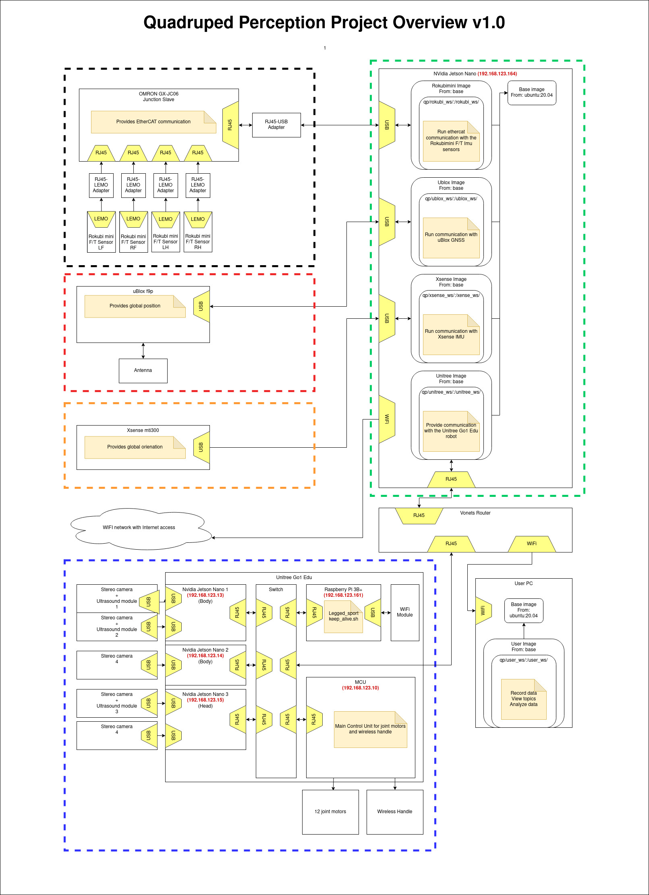

# How to work with Unitree Robot

## Robots

### A1

This is Go1's older brother, which is not selled anymore, but is very popular among researchers.

> ⚠️ **TODO:** add photo of A1

> ⚠️ **TODO:** add description of A1 robots used at PUT

### Go1 

Go1 robot is available in 3 versions:
- Air
- Pro
- Edu

> ⚠️ **TODO:** add photo of Go1

> ⚠️ **TODO:** add description of Go1 robots used at PUT


## Official distributors 
In Poland there are at least 2 companies officially selling Unitree robots:
 - [Edu4Industry](https://edu4industry.com/)
 - [Botland](https://botland.com.pl/)

## References
- [Go1 Air](https://botland.com.pl/roboty-kroczace/21624-czworonozna-platforma-kroczaca-robo-pies-unitree-go1-air.html)
- [Go1 Pro](https://botland.com.pl/roboty-kroczace/21626-czworonozna-platforma-kroczaca-robo-pies-unitree-go1-pro.html)
- [Go1 Edu](https://botland.com.pl/roboty-kroczace/21627-czworonozna-platforma-kroczaca-robo-pies-unitree-go1-edu.html)

---

# A1 
## Architecture

## Modes

# Go1

## Components

## Network setup
You can connect to the Unitree Wifi Network, but it will not allow you to view and execute ROS related processes.

It is recommended to buy a external router like Vonets

Log into the router to change the mode to bridge and range of IPs to 192.168.123.* . It will allow to forward communication between your PC and all computers onboard (also the MCU).

Set the static ip for your laptop 

## Control

The default control mode when booting is the so called "normal" mode, which is clumsy and doesn't have tricks enabled. As soon as robot boots, the `keep_sport_alive.sh` script kicks in, which sole purpose is to start and keep the "sport" mode of the robot.
It loads `Legged_sport` controller executable file, which is the "sport" mode.

In order to control robot with ROS controllers, you should make sure to stop both of them to avoid conflicts.

### Stopping the onboard controllers

1. Switch on the robot, let it standup

2. Log into the RPI computer:
```bash
ssh pi@192.168.123.161
```
Password is default: `123`

2. Check the PID for `keep_sport_alive.sh` and `Legged_sport`
``` sh
ps aux | grep "keep_sport_alive"
```
``` sh
ps aux | grep "Legged_sport"
```

Kill both processes with:

```sh
sudo kill -9 <PID for Legged_sport> <PID for keep_sport_alive>
```


### Running ROS controllers

```sh
sudo docker exec -it qp-unitree-container bash
cd unitree_ws/ && mkdir src && cd src
git clone https://github.com/filesmuggler/unitree_guide.git
git clone https://github.com/filesmuggler/unitree_ros.git
git clone https://github.com/filesmuggler/unitree_ros_to_real.git
git clone -b go1 https://github.com/filesmuggler/unitree_legged_sdk.git

cd ..
catkin build
```


### Install newer cmake on jetson
https://askubuntu.com/questions/1203635/installing-latest-cmake-on-ubuntu-18-04-3-lts-run-via-wsl-openssl-error

https://askubuntu.com/questions/1192955/how-to-install-g-10-on-ubuntu-18-04
+
sudo nano /etc/hosts


## Unitree guide (Run all step-by-step)

### 1. Turn on the robot and the sensor box

Make sure all peripherials are connected according to the schematics available below or in the [PDF file](./pdfs/qp_schematics.pdf).
<figure>
   <p style='text-align: center;'>
      <br>
      QP overview structure, Source: <a href="">Own work</a>
   </p>
</figure>


